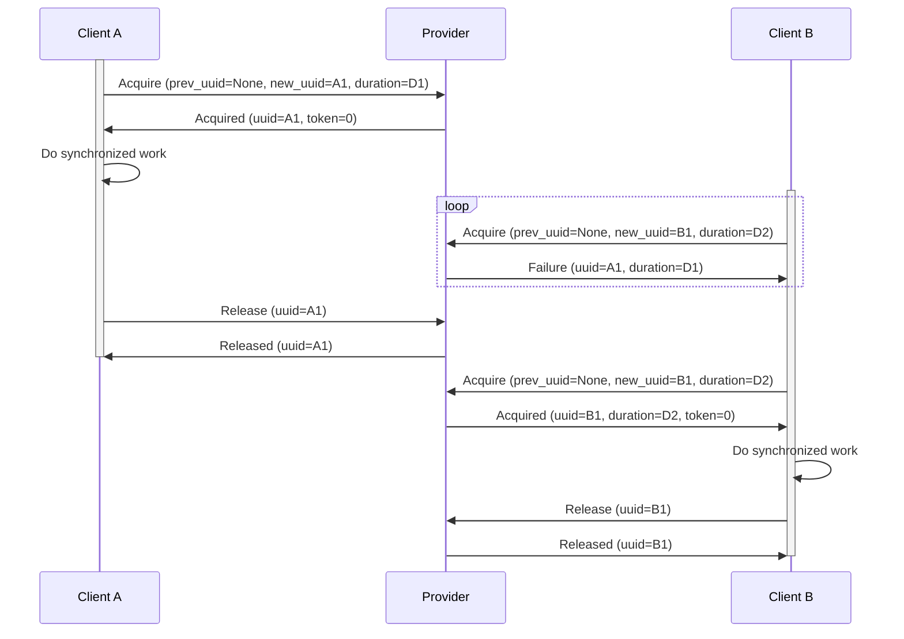
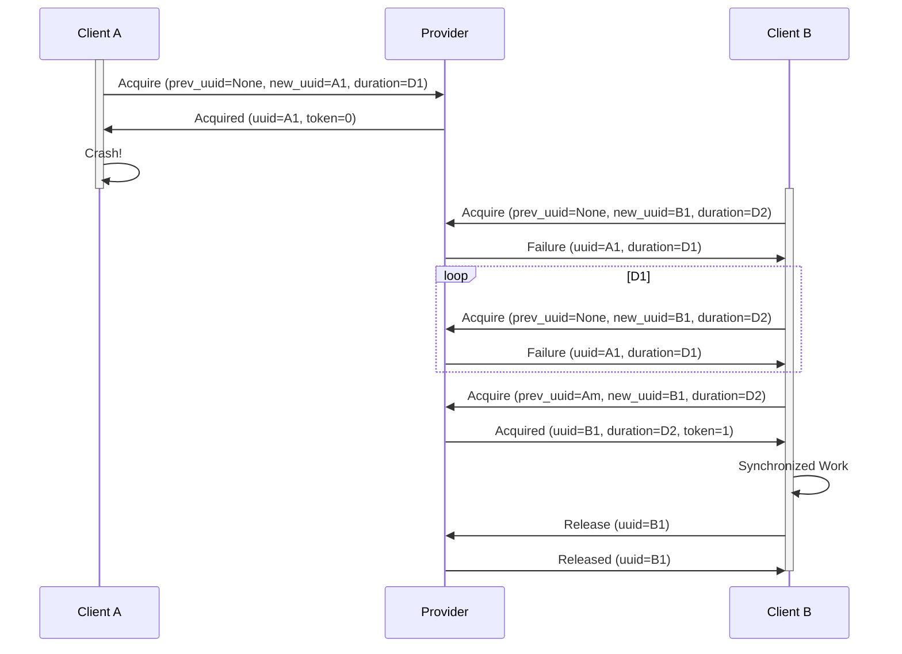
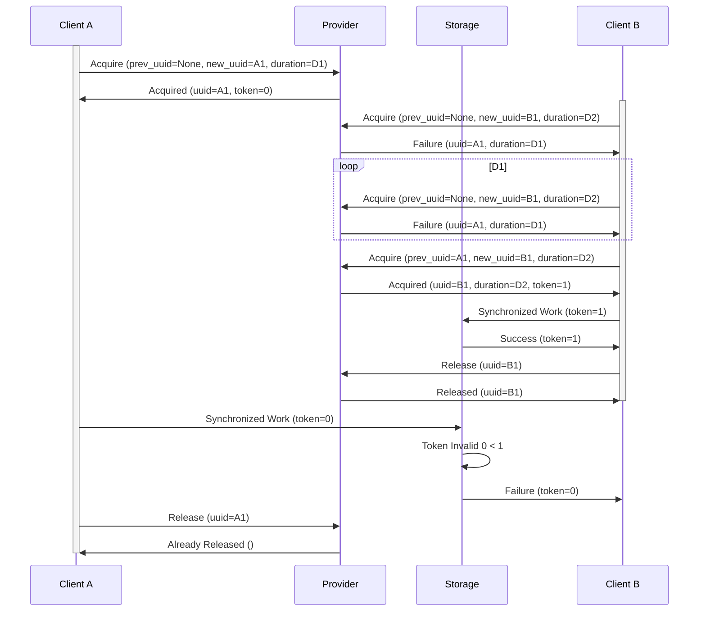

# DLock
A lease based locking implementations for distributed clients with support for a fencing token to prevent usage of stale locks.

[![Crates.io][crates-badge]][crates-url]
[![MIT licensed][mit-badge]][mit-url]
[![Build Status][actions-badge]][actions-url]

[crates-badge]: https://img.shields.io/crates/v/dlock
[crates-url]: https://crates.io/crates/dlock
[mit-badge]: https://img.shields.io/badge/license-MIT-blue.svg
[mit-url]: https://github.com/kodebooth/dlink/blob/main/LICENSE
[actions-badge]: https://github.com/kodebooth/dlock/workflows/CI/badge.svg
[actions-url]: https://github.com/kodebooth/dlock/actions?query=workflow%3ACI+branch%3Amain

# Overview
`DLock` is a lease based distributed lock implementation. It supports recovering from a dead lease holder as well as provides a fencing token to prevent usage of stale tokens.

The implementation has a generic frontend called `DLock` which accepts a provider backend to support the actual locking implementation. Currently it only provides a AWS DynamoDB provider backend.

## Algorithm
The following diagram shows a basic lock contention where Client A has already acquired the lock when Client B attempts to get the lock.


The following diagram shows a dead lease recovery scenario where Client A has died after acquiring the lock.


The following diagram shows a paused lease holder scenario where Client A is interrupted for a long time and the fencing token is used to ensure correct behavior.

# Example
Add `DLock` to your crate:
```toml
[dependencies]
dlock = "0.1"
```

Create a provider for the lock backend:
```rust
let client = ... // Create a aws_sdk_dynamodb::Client based on your project configuration
let provider = DynamodbProvider::builder()
    .client(Arc::new(client))
    .table_name("dynamodb_table".to_string())
    .build();
```

You can use the automatic lease renewal mechanism built into `DLock` or manually manage the lease yourself:

## Automatic
`with` will acquire, automatically renew, and release the lease. For more information see the function documentation.
```rust
let lock = DLock::builder()
    .name("my_lock".to_string())
    .duration(Duration::from_secs(1))
    .provider(provider)
    .build();

let result = lock.with(async |token| 
    // Synchronized Work
).await?;
```

## Manually
You are responsible for acquiring, renewing, and releasing the lease.
```rust
let lock = DLock::builder()
    .name("my_lock".to_string())
    .duration(Duration::from_secs(10))
    .provider(provider)
    .build();
let lease = lock.acquire().await?;
// Synchronized Work
lease.release().await?;
```